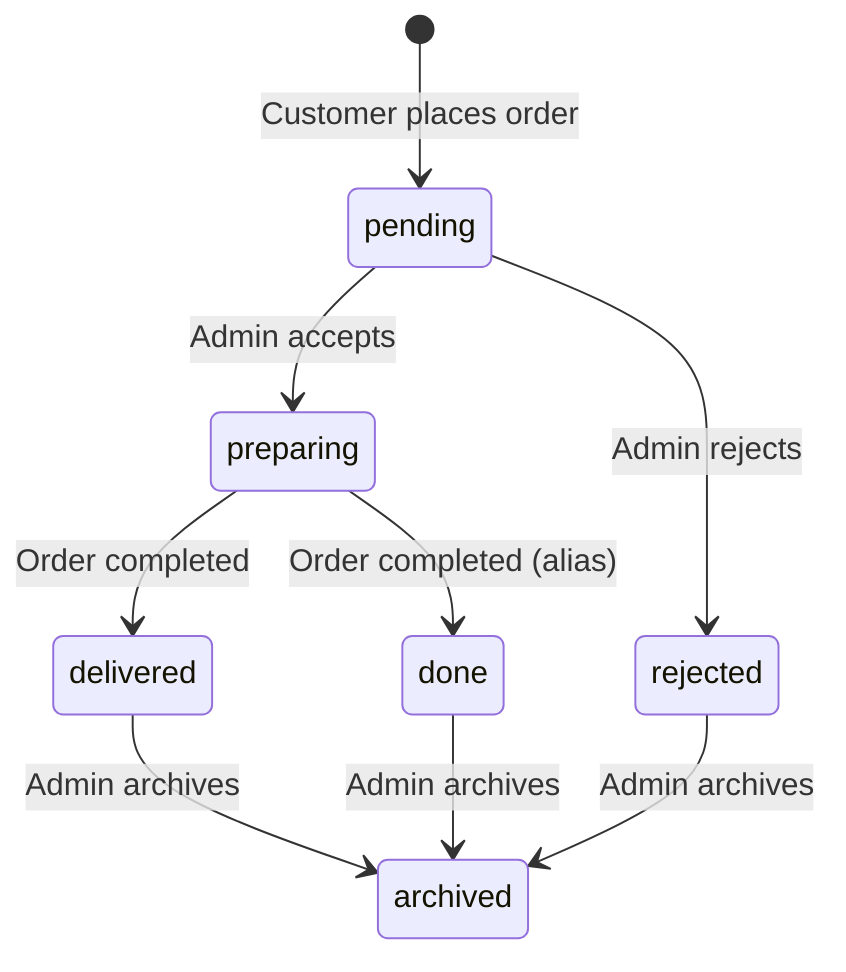

# Product Requirements Document (PRD)

## Santafe Restaurant Platform

| Field | Value |
|-------|-------|
| **Product** | Santafe (سانتافى) — Multi-branch restaurant ordering platform |
| **Version** | 0.1.0 |
| **Last updated** | June 18, 2026 |
| **Status** | Live / active development |

---

## 1. Executive Summary

Santafe is a web-based restaurant platform for a fried chicken and burger chain operating across three branches in Egypt: **Mansoura**, **Mit Ghamr**, and **Zagazig**. The product serves three audiences:

1. **Customers** — browse menus, place delivery orders, track history, and participate in promotions (spin wheel, coupons, offers).
2. **Branch admins** — manage day-to-day operations for a single branch (menu, orders, coupons, delivery zones).
3. **Owner** — monitor performance across all branches, set staff targets, and review weekly reports.

The platform is built as a single-page React application backed by Firebase (Auth, Firestore, Cloud Functions) and deployed via Firebase Hosting (with Netlify configuration also present).

---

## 2. Problem Statement

A multi-location restaurant needs:

- A branded online ordering experience per branch, without mixing inventory or delivery zones.
- Real-time order management for kitchen and delivery staff.
- Centralized visibility for the business owner across branches.
- Promotional tools (coupons, offers, spin wheel) to drive repeat orders.

Existing generic food-delivery aggregators do not provide branch-level control, custom branding, or integrated loyalty mechanics. Santafe addresses this with a purpose-built, Firebase-backed solution.

---

## 3. Goals & Success Metrics

### Business goals

| Goal | Description |
|------|-------------|
| Increase online orders | Provide a fast, mobile-friendly ordering flow |
| Reduce order errors | Structured cart, modifiers, and delivery zone selection |
| Improve retention | Coupons, spin wheel, email subscribers, recommendations |
| Operational efficiency | Real-time admin dashboards with order notifications |

### Success metrics (KPIs)

| Metric | Target / measurement |
|--------|---------------------|
| Order completion rate | % of checkouts that result in a placed order |
| Average order value (AOV) | Revenue ÷ delivered orders per branch |
| Repeat customer rate | % of orders from returning authenticated clients |
| Order fulfillment time | Time from `pending` → `delivered` |
| Coupon redemption rate | Used coupons ÷ issued coupons |
| Spin wheel engagement | Daily unique spins ÷ logged-in users |

---

## 4. User Personas

### 4.1 Customer (عميل)

- Lives in Mansoura, Mit Ghamr, or Zagazig.
- Orders fried chicken, burgers, and sides for delivery.
- Prefers Arabic UI; may switch to English.
- Uses mobile browser; may pay via Vodafone Cash or InstaPay.

### 4.2 Branch Admin (مدير فرع)

- Manages one assigned branch (`mansoura`, `mit_ghamr`, or `zagazig`).
- Updates menu items, handles incoming orders, prints receipts.
- Configures branch-specific coupons, delivery zones, and recommendations.

### 4.3 Owner (مالك)

- Oversees all three branches.
- Reviews revenue, top/slow products, payment method breakdown.
- Sets performance targets for staff and archives weekly reports.

---

## 5. Product Scope

### 5.1 In scope (current)

- Multi-branch client experience with branch persistence (localStorage).
- Full menu browsing with categories, product details, sizes, and modifiers.
- Shopping cart and multi-step checkout.
- Client authentication (email/password, Google).
- Order placement with delivery zone fees and coupon application.
- Admin dashboard per branch (products, categories, orders, archive, coupons, delivery, recommendations, modifiers, offers, spin settings).
- Owner dashboard with cross-branch analytics, targets, and weekly reports.
- Spin wheel promotion with server-side prize selection (Cloud Function).
- Bilingual UI (Arabic / English) with RTL support.
- Email newsletter signup on homepage.
- Cookie consent and privacy policy pages.
- Firestore security rules with role-based access.

### 5.2 Out of scope (current release)

- Native mobile apps (iOS / Android).
- In-app card/wallet payments via Paymob (env vars exist; integration not implemented in client).
- Automated SMS / push notifications.
- Driver tracking / live GPS.
- Inventory stock management.
- POS integration.

### 5.3 Planned / future

- Paymob payment gateway (card + wallet) — configuration placeholders in `.env.example`.
- Automated weekly report generation (currently manual entry supported on owner dashboard).
- Expanded English translations beyond navigation and hero sections.

---

## 6. User Journeys

### 6.1 Customer order flow

```
Branch Selector → Home / Menu → Product Details → Add to Cart
    → Checkout (delivery info → payment method → confirm)
    → Order created in branch + all_orders → My Orders / Profile
```

**Preconditions:** User must select a branch before accessing client routes. Authenticated users get profile pre-fill and order history.

### 6.2 Admin order handling

```
Admin Login → Branch Dashboard → Orders tab (real-time)
    → Update status (pending → preparing → delivered / rejected)
    → Optional: print order → Archive when complete
```

**Preconditions:** Firebase Auth user with `admins/{uid}` document where `role = "admin"` and `branchId` matches route.

### 6.3 Owner oversight

```
Admin Login (owner role) → Owner Dashboard
    → View branch stats, top/slow products, payment breakdown
    → Set staff targets → Generate / save weekly reports
```

---

## 7. Functional Requirements

### 7.1 Client — Branch selection

| ID | Requirement | Priority |
|----|-------------|----------|
| C-01 | User selects one of three branches before browsing | P0 |
| C-02 | Selected branch persists across sessions (localStorage) | P0 |
| C-03 | User can change branch from navigation | P1 |
| C-04 | Branch info shown: name, area, phone, hours | P2 |

**Branches:** `mansoura`, `mit_ghamr`, `zagazig`

---

### 7.2 Client — Menu & products

| ID | Requirement | Priority |
|----|-------------|----------|
| C-10 | Display products grouped by category | P0 |
| C-11 | Product detail page with images, description, sizes (single/double/triple) | P0 |
| C-12 | Support product-level discounts (percent / fixed) | P1 |
| C-13 | Modifier groups (global `modifierGroups` collection) selectable on products | P1 |
| C-14 | Highlight new products on homepage | P2 |
| C-15 | Product recommendations popup at checkout | P1 |

**Data source:** `{branchId}/products/data/*`, `{branchId}/categories/data/*`, `modifierGroups/*`

---

### 7.3 Client — Cart & checkout

| ID | Requirement | Priority |
|----|-------------|----------|
| C-20 | Persistent cart sidebar with quantity controls | P0 |
| C-21 | Multi-step checkout: delivery info → payment → confirm | P0 |
| C-22 | Delivery zone selection with per-zone fees | P0 |
| C-23 | Free delivery when cart subtotal ≥ `VITE_FREE_DELIVERY_THRESHOLD` | P1 |
| C-24 | Coupon code entry with validation (min order, expiry, usage limit) | P0 |
| C-25 | Auto-apply spin wheel coupon from localStorage (`pendingWheelCoupon`) | P1 |
| C-26 | Payment methods: cash on delivery, Vodafone Cash, InstaPay (manual transfer) | P0 |
| C-27 | Order written to `{branchId}/orders/data/{orderId}` and `all_orders/{orderId}` | P0 |
| C-28 | Coupon `usageCount` incremented atomically on order placement | P1 |

---

### 7.4 Client — Authentication & profile

| ID | Requirement | Priority |
|----|-------------|----------|
| C-30 | Register and login with email/password | P0 |
| C-31 | Login with Google | P1 |
| C-32 | Client profile stored in `clients/{uid}` | P0 |
| C-33 | Order history from `all_orders` filtered by `clientUid` | P0 |
| C-34 | Profile page: name, phone, address editing | P1 |

---

### 7.5 Client — Promotions

| ID | Requirement | Priority |
|----|-------------|----------|
| C-40 | Dedicated Offers page per branch | P1 |
| C-41 | Spin wheel (`ClientSpinWheel`) with weighted prizes | P1 |
| C-42 | One spin per user per day (enforced client + server) | P1 |
| C-43 | Winning spin creates coupon code (e.g. `SPIN-XXXXXX`) for checkout | P1 |
| C-44 | Spin config managed in `spinConfig`; logs in `spinLogs`, `spinUsers` | P2 |

**Cloud Function:** `spinWheel` (europe-west1) — server-side prize selection and coupon creation.

---

### 7.6 Client — Marketing & compliance

| ID | Requirement | Priority |
|----|-------------|----------|
| C-50 | Homepage hero, featured products, newsletter signup | P1 |
| C-51 | Email captured to `subscribers` collection | P2 |
| C-52 | About and Contact pages | P2 |
| C-53 | Privacy policy page | P1 |
| C-54 | Cookie consent banner | P1 |
| C-55 | Arabic (default) and English language toggle | P1 |

---

### 7.7 Admin — Dashboard (per branch)

| ID | Requirement | Priority |
|----|-------------|----------|
| A-01 | Access via `/admin/dashboard/{branchId}` with role + branch guard | P0 |
| A-02 | **Products tab:** CRUD products, images (Cloudinary), sizes, discounts, emoji | P0 |
| A-03 | **Categories tab:** CRUD categories | P0 |
| A-04 | **Orders tab:** Real-time order list, status updates, sound notification | P0 |
| A-05 | **Archive tab:** View/manage archived orders | P1 |
| A-06 | **Coupons tab:** Create/edit discount coupons per branch | P1 |
| A-07 | **Delivery zones tab:** Configure zones and fees | P0 |
| A-08 | **Recommendations tab:** Configure upsell items at checkout | P1 |
| A-09 | **Modifiers tab:** Manage global modifier groups | P1 |
| A-10 | **Offers tab:** Branch offers and offer items | P1 |
| A-11 | **Spin settings tab:** Configure wheel prizes and weights | P2 |
| A-12 | Order print view for kitchen/receipt | P1 |
| A-13 | Image cropper modal for product uploads | P2 |

**Order statuses:** `pending`, `preparing`, `delivered` / `done`, `rejected`

---

### 7.8 Owner — Dashboard

| ID | Requirement | Priority |
|----|-------------|----------|
| O-01 | Access via `/owner` with `role = "owner"` | P0 |
| O-02 | Real-time stats per branch: revenue, order counts by status | P0 |
| O-03 | Top and slow-moving products across branches | P1 |
| O-04 | Payment method breakdown | P1 |
| O-05 | Staff targets CRUD (`ownerTargets/main/data`) | P2 |
| O-06 | Manual weekly report entry and save | P2 |
| O-07 | Weekly reports history at `/owner/reports` | P2 |

---

## 8. Data Model

### 8.1 Global collections

| Collection | Purpose | Access |
|------------|---------|--------|
| `admins/{uid}` | `{ role, branchId }` — admin or owner | Read own doc only |
| `clients/{uid}` | Customer profile fields | Read/write own doc |
| `all_orders/{orderId}` | Cross-branch order index for client history | Create (client), read (owner or order client) |
| `subscribers/{id}` | Newsletter emails | Public create |
| `modifierGroups/{id}/options/{id}` | Shared product modifiers | Public read |
| `offers/{id}`, `offerItems/{id}` | Global offer definitions | Public read |
| `configs/{id}` | App-wide config | Public read |
| `spinConfig/{id}` | Spin wheel configuration | Public read |
| `spinLogs/{dateId}` | Daily spin analytics | Signed-in users |
| `spinUsers/{userId}` | User spin history | Own user or admin |
| `weeklyReports/data/reports/{id}` | Saved weekly reports | Owner only |
| `ownerTargets/main/data/{id}` | Staff performance targets | Owner only |

### 8.2 Branch-scoped data

Pattern: `{branchId}/{section}/data/{docId}` or `{branchId}/{section}`

| Section | Purpose |
|---------|---------|
| `products` | Menu items |
| `categories` | Menu categories |
| `orders` | Active orders |
| `archived_orders` | Completed/archived orders |
| `discountCoupons` | Branch coupons |
| `deliveryZones` | Delivery areas and fees |
| `deliveryConfig` | Branch delivery settings |
| `recommendations` | Checkout upsell config |
| `offers`, `offerItems`, `offersPageConfig` | Branch-specific offers |

**Branch IDs:** `mansoura`, `mit_ghamr`, `zagazig`

### 8.3 Order document (key fields)

```text
{
  clientUid, branchId, status, items[], total / totalPrice,
  paymentMethod, deliveryZone, couponCode,
  customer: { name, phone, address, notes },
  createdAt, archived?
}
```

---

## 9. Technical Architecture

### 9.1 Stack

| Layer | Technology |
|-------|------------|
| Frontend | React 19, Vite 7, React Router 7 |
| Styling | Tailwind CSS 3, Framer Motion 12 |
| Backend | Firebase Auth, Firestore, Cloud Functions |
| Media | Cloudinary (product images) |
| Hosting | Firebase Hosting (`dist/`), Netlify config present |
| CI | GitHub Actions (`.github/workflows/ci.yml`) |
| Node | ≥ 20.19.0 |

### 9.2 Application structure

```text
src/
  pages/          # Route-level views (client, admin, owner)
  components/     # Shared UI + admin tabs
  context/        # Branch, cart, auth, language state
  services/       # Firestore data access
  utils/          # Pricing, spin logic
  hooks/          # useBranchProducts, etc.
functions/
  src/wheelSpin.ts  # Callable Cloud Function
```

### 9.3 Routing

| Route | Access |
|-------|--------|
| `/branches` | Public |
| `/login` | Public |
| `/`, `/menu`, `/checkout`, etc. | Requires selected branch |
| `/admin` | Admin login |
| `/admin/dashboard/{branch}` | Admin for branch |
| `/owner`, `/owner/reports` | Owner only |

### 9.4 State management

- **ClientBranchContext** — selected branch (localStorage).
- **CartContext** — in-memory cart.
- **ClientAuthContext** — Firebase Auth for customers.
- **BranchContext** — admin branch from URL + auth.
- **LanguageContext** — `ar` / `en` with localStorage.

### 9.5 Pricing engine (`src/utils/pricing.js`)

- Product base price by size (`price_single`, `price_double`, `price_triple`).
- Product-level discounts (percent / fixed).
- Coupon discounts with min order and expiry checks.
- Free delivery via coupon type or cart threshold.
- `calculateFinalTotals()` returns subtotal, coupon discount, delivery fee, total.

---

## 10. Security & Access Control

### 10.1 Roles

| Role | Capabilities |
|------|--------------|
| **Client** | Own profile, place orders, read public menu, spin wheel |
| **Admin** | Full branch management for assigned `branchId` |
| **Owner** | All branches read/write, targets, reports |

### 10.2 Firestore rules (summary)

- Admin docs are read-only from client (no client writes).
- Orders: clients create with matching `clientUid` and `branchId`; admins update.
- Coupons: clients can increment `usageCount` only (validated diff).
- Products/categories: public read; admin/owner write.
- Spin users: create once per user; no updates.

Rules file: `firestore.rules`

### 10.3 Environment variables

See `.env.example` for Firebase config, payment phone, free delivery threshold, and dev admin fallbacks.

---

## 11. Non-Functional Requirements

| Category | Requirement |
|----------|-------------|
| **Performance** | Lazy-load admin/owner dashboards; real-time listeners for orders |
| **Mobile** | Responsive Tailwind layouts; touch-friendly cart and checkout |
| **Accessibility** | Semantic sections, `aria-label` on key homepage regions |
| **i18n** | Arabic default (RTL); English for nav/hero; expand over time |
| **SEO** | `react-helmet-async`, sitemap, robots.txt, prerender plugin in build |
| **Availability** | Firebase SLA; SPA rewrites for client-side routing |
| **Browser support** | Modern evergreen browsers per `browserslist` |

---

## 12. Integrations

| Integration | Status | Notes |
|-------------|--------|-------|
| Firebase Auth | ✅ Active | Email, Google |
| Firestore | ✅ Active | Primary database |
| Cloudinary | ✅ Active | Product image uploads |
| Cloud Functions | ✅ Active | `spinWheel` callable |
| Paymob | ⏳ Planned | Env vars only |
| Vodafone Cash / InstaPay | ✅ Manual | Display phone number; customer transfers offline |
| Google Sign-In | ✅ Active | Client login |

---

## 13. Deployment & Operations

```bash
npm install
cp .env.example .env   # fill Firebase and payment values
npm run dev            # local development
npm run build          # production build
npm run deploy         # build + firebase deploy (hosting, firestore rules)
```

- **Firestore rules** deployed with `firebase deploy --only firestore`.
- **Functions** in `functions/` (Node); deploy via Firebase CLI.
- **CI** runs on GitHub push/PR.

---

## 14. Open Questions & Risks

| Item | Notes |
|------|-------|
| Paymob integration | Env prepared but no client implementation — cash/manual only today |
| Payment verification | Manual methods rely on customer honesty; no auto-confirmation |
| Branch product parity | Each branch maintains its own product catalog |
| Spin wheel abuse | Mitigated by daily limit + server function; monitor `spinLogs` |
| Admin doc provisioning | `admins/{uid}` must be created server-side; email fallbacks in env for dev |

---

## 15. Appendix

### A. Order status lifecycle



### B. Key files reference

| Area | Path |
|------|------|
| Routes | `src/App.jsx` |
| Firestore rules | `firestore.rules` |
| Pricing | `src/utils/pricing.js` |
| Checkout | `src/pages/Checkout.jsx` |
| Admin dashboard | `src/pages/AdminDashboard.jsx` |
| Owner dashboard | `src/pages/OwnerDashboard.jsx` |
| Spin function | `functions/src/wheelSpin.ts` |
| Translations | `src/context/LanguageContext.jsx` |

### C. Revision history

| Date | Version | Changes |
|------|---------|---------|
| 2026-06-18 | 1.0 | Initial PRD created from codebase analysis |
